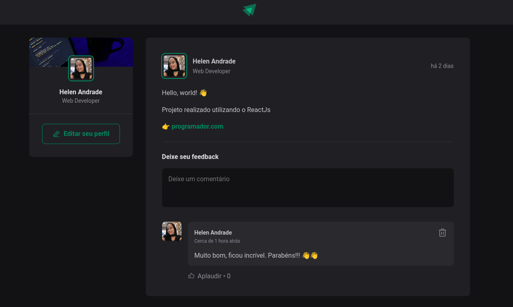

# Feed

## Projeto criado utilizando ReactJs e TypeScript. Consiste em um feed responsivo com as funcionalidades de adicionar e apagar comentários, além de poder deixar quantos 'likes' quiser.

    
    

# Funcionalidades

* Adicionar um novo comentário

* Apagar comentário

* Deixar quandos 'likes' quiser

# Tecnologias Utilizadas

* ReactJS - Para construção da interface

* JavaScript/TypeScript - Para lógica de programação e tipagem 

* CSS - Para estilização da interface

* React Hooks - Para gerenciamento de estado

# Conceitos Abordados

Estados e Imutabilidade do estado

Listas e chaves no ReactJS

Propriedades

Componentização

# Como utilizar

1- Clone o projeto
`git@github.com:helen-andrade/feed.git`

2- Instale as dependências
`npm i`

3- Rode o script de desenvolvimento
`npm run dev`

---

    
Feito com ♡ por Helen Andrade

